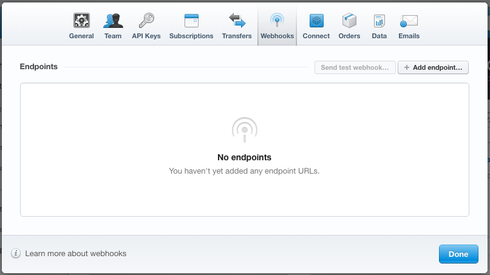
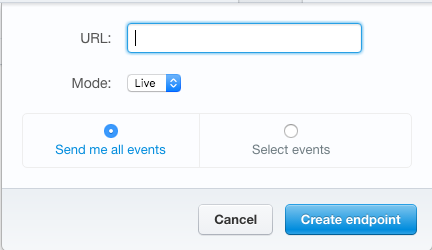

# Webhooks

Stripe sends a events for just about everything that happens in its system as
a JSON payload to a webhook.

A webhook is an endpoint running your site that accepts `POST` requests. You
provide the full url to this endpoint in the settings at Stripe so it knows
where to send the payloads.

## Setup

Click onto your Stripe settings panel and then click on the Webhooks tab:




From there click on add endpoint button and add the full url:



`pinax-stripe` ships with a webhook view and all the code necessary to process
and store events sent to your webhook.  If you install the `pinax-stripe` urls
like so:

```python
url(r"^payments/", include("pinax.stripe.urls")),
```

Then the full url to your webhook that you'll need to enter into the Stripe UI
pictured above is:

    https://yourdomain.com/payments/webhook/

## Security

Since this is a wide open URL we do not want to record and react to any data
sent our way.  Therefore, we actually record the data that is sent, but then
before processing it, we validate it against the Stripe API.  If it validates
as untampered data, then we continue the processing.

If validation fails, then `Event.valid` will be set to `False` enabling at
least some data to try and hunt down any malicious activity.

## Signals

`pinax-stripe` handles certain events in the webhook processing that are
important for certain operations like syncing data or deleting cards. Every
event, though, has a corresponding signal that is sent, so you can hook into
these events in your project.  See [the signals reference](signals.md) for
details on how to wire those up.

## Events

* `account.updated` - Occurs whenever an account status or property has changed.
* `account.application.deauthorized` - Occurs whenever a user deauthorizes an application. Sent to the related application only.
* `account.external_account.created` - Occurs whenever an external account is created.
* `account.external_account.deleted` - Occurs whenever an external account is deleted.
* `account.external_account.updated` - Occurs whenever an external account is updated.
* `application_fee.created` - Occurs whenever an application fee is created on a charge.
* `application_fee.refunded` - Occurs whenever an application fee is refunded, whether from refunding a charge or from refunding the application fee directly, including partial refunds.
* `application_fee.refund.updated` - Occurs whenever an application fee refund is updated.
* `balance.available` - Occurs whenever your Stripe balance has been updated (e.g. when a charge collected is available to be paid out). By default, Stripe will automatically transfer any funds in your balance to your bank account on a daily basis.
* `bitcoin.receiver.created` - Occurs whenever a receiver has been created.
* `bitcoin.receiver.filled` - Occurs whenever a receiver is filled (that is, when it has received enough bitcoin to process a payment of the same amount).
* `bitcoin.receiver.updated` - Occurs whenever a receiver is updated.
* `bitcoin.receiver.transaction.created` - Occurs whenever bitcoin is pushed to a receiver.
* `charge.captured` - Occurs whenever a previously uncaptured charge is captured.
* `charge.failed` - Occurs whenever a failed charge attempt occurs.
* `charge.refunded` - Occurs whenever a charge is refunded, including partial refunds.
* `charge.succeeded` - Occurs whenever a new charge is created and is successful.
* `charge.updated` - Occurs whenever a charge description or metadata is updated.
* `charge.dispute.closed` - Occurs when the dispute is resolved and the dispute status changes to won or lost.
* `charge.dispute.created` - Occurs whenever a customer disputes a charge with their bank (chargeback).
* `charge.dispute.funds_reinstated` - Occurs when funds are reinstated to your account after a dispute is won.
* `charge.dispute.funds_withdrawn` - Occurs when funds are removed from your account due to a dispute.
* `charge.dispute.updated` - Occurs when the dispute is updated (usually with evidence).
* `coupon.created` - Occurs whenever a coupon is created.
* `coupon.deleted` - Occurs whenever a coupon is deleted.
* `coupon.updated` - Occurs whenever a coupon is updated.
* `customer.created` - Occurs whenever a new customer is created.
* `customer.deleted` - Occurs whenever a customer is deleted.
* `customer.updated` - Occurs whenever any property of a customer changes.
* `customer.discount.created` - Occurs whenever a coupon is attached to a customer.
* `customer.discount.deleted` - Occurs whenever a customer's discount is removed.
* `customer.discount.updated` - Occurs whenever a customer is switched from one coupon to another.
* `customer.source.created` - Occurs whenever a new source is created for the customer.
* `customer.source.deleted` - Occurs whenever a source is removed from a customer.
* `customer.source.updated` - Occurs whenever a source's details are changed.
* `customer.subscription.created` - Occurs whenever a customer with no subscription is signed up for a plan.
* `customer.subscription.deleted` - Occurs whenever a customer ends their subscription.
* `customer.subscription.trial_will_end` - Occurs three days before the trial period of a subscription is scheduled to end.
* `customer.subscription.updated` - Occurs whenever a subscription changes. Examples would include switching from one plan to another, or switching status from trial to active.
* `invoice.created` - Occurs whenever a new invoice is created. If you are using webhooks, Stripe will wait one hour after they have all succeeded to attempt to pay the invoice; the only exception here is on the first invoice, which gets created and paid immediately when you subscribe a customer to a plan. If your webhooks do not all respond successfully, Stripe will continue retrying the webhooks every hour and will not attempt to pay the invoice. After 3 days, Stripe will attempt to pay the invoice regardless of whether or not your webhooks have succeeded. See how to respond to a webhook.
* `invoice.payment_failed` - Occurs whenever an invoice attempts to be paid, and the payment fails. This can occur either due to a declined payment, or because the customer has no active card. A particular case of note is that if a customer with no active card reaches the end of its free trial, an invoice.payment_failed notification will occur.
* `invoice.payment_succeeded` - Occurs whenever an invoice attempts to be paid, and the payment succeeds.
* `invoice.updated` - Occurs whenever an invoice changes (for example, the amount could change).
* `invoiceitem.created` - Occurs whenever an invoice item is created.
* `invoiceitem.deleted` - Occurs whenever an invoice item is deleted.
* `invoiceitem.updated` - Occurs whenever an invoice item is updated.
* `order.created` - Occurs whenever an order is created.
* `order.payment_failed` - Occurs whenever payment is attempted on an order, and the payment fails.
* `order.payment_succeeded` - Occurs whenever payment is attempted on an order, and the payment succeeds.
* `order.updated` - Occurs whenever an order is updated.
* `plan.created` - Occurs whenever a plan is created.
* `plan.deleted` - Occurs whenever a plan is deleted.
* `plan.updated` - Occurs whenever a plan is updated.
* `product.created` - Occurs whenever a product is created.
* `product.updated` - Occurs whenever a product is updated.
* `recipient.created` - Occurs whenever a recipient is created.
* `recipient.deleted` - Occurs whenever a recipient is deleted.
* `recipient.updated` - Occurs whenever a recipient is updated.
* `sku.created` - Occurs whenever a SKU is created.
* `sku.updated` - Occurs whenever a SKU is updated.
* `transfer.created` - Occurs whenever a new transfer is created.
* `transfer.failed` - Occurs whenever Stripe attempts to send a transfer and that transfer fails.
* `transfer.paid` - Occurs whenever a sent transfer is expected to be available in the destination bank account. If the transfer failed, a transfer.failed webhook will additionally be sent at a later time. Note to Connect users: this event is only created for transfers from your connected Stripe accounts to their bank accounts, not for transfers to the connected accounts themselves.
* `transfer.reversed` - Occurs whenever a transfer is reversed, including partial reversals.
* `transfer.updated` - Occurs whenever the description or metadata of a transfer is updated.
* `ping` - May be sent by Stripe at any time to see if a provided webhook URL is working.
