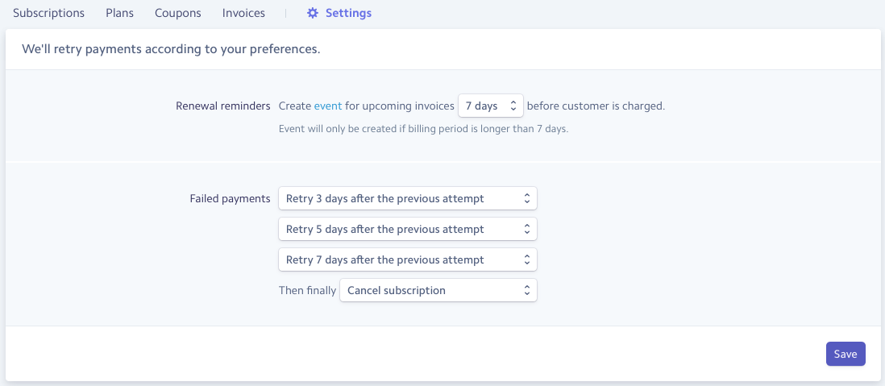

# Software as a Service

SaaS projects require minimal setup to manage subscriptions for your software.
You will need to configure settings, middleware and a few settings in the Stripe.com management screens. 

## Settings

The following settings marked as **Required** will need to exist in your settings file.

### PINAX_STRIPE_DEFAULT_PLAN 

**Required**

`PINAX_STRIPE_DEFAULT_PLAN`

Sets a default plan and is used if you have a scenario where you want to auto-subscribe new users to a plan upon signup.

### PINAX_STRIPE_SUBSCRIPTION_REQUIRED_REDIRECT

**Required**

`PINAX_STRIPE_SUBSCRIPTION_REQUIRED_REDIRECT`  

The URL of where to redirect requests to that are not from a user with an active subscription when the `pinax.stripe.middleware.ActiveSubscriptionMiddleware` is active.

### PINAX_STRIPE_SUBSCRIPTION_REQUIRED_EXCEPTION_URLS

`PINAX_STRIPE_SUBSCRIPTION_REQUIRED_EXCEPTION_URLS`

A list of any URLs exempt from requiring an active subscription.  The middleware in `pinax.stripe.middleware.ActiveSubscriptionMiddleware` will allow access to these URLs.

## Stripe Settings

Settings for subscriptions will need to be configured for your service's subscription within Stripe's dashboard.
Set your preference for what happens with failed payments and the cancellation.  When a card fails, Stripe will send a webhook to update the customer's status.
If the customer's subscription has been cancelled, the middleware will redirect the user to the predefined url notifying them of a problem
with their account.

## Middleware

Add `"pinax.stripe.middleware.ActiveSubscriptionMiddleware"` to the middleware settings.